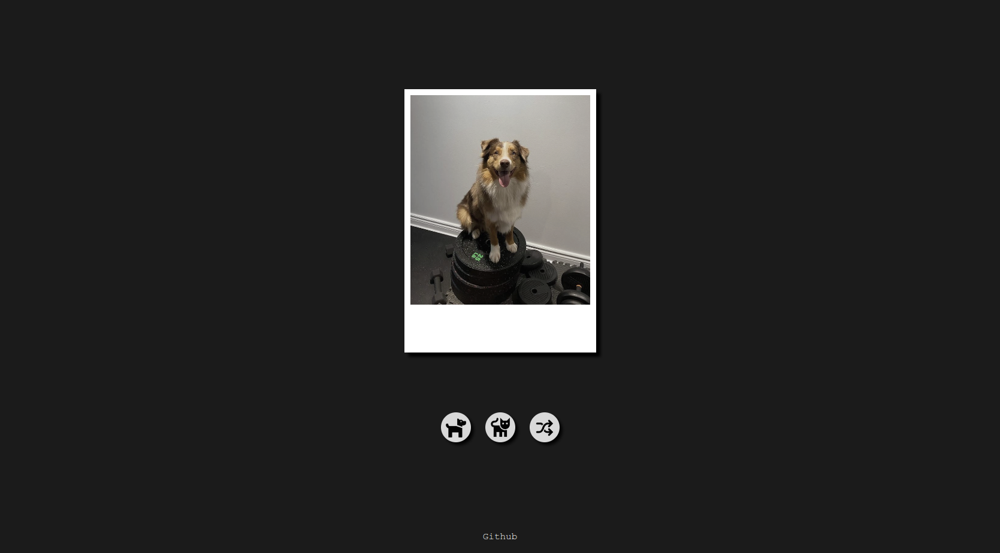

># Polaroid pet

## Projeto completo!

## Sobre o projeto
        Esse projeto foi desenvolvido a fim de exercitar meus conhecimentos com assincronicidade em JavaScript puro. 
        Ele consiste em 3 botões, em que o primeiro e segundo, faz uma requisição via "fetch" para uma 
        API (link logo abaixo), cada um para uma API diferente, e como resposta retorna um Promisse contendo uma 
        imagem, que ao receber é tratado para se encaixar no polaroid no meio da tela. Já o terceiro botão faz 
        aquisição ao mesmo tempo para as duas APIs e a primeira a dar resposta, que não seja rejeitada, se encaixa 
        na polaroid no meio da tela.

        - Cachorro: https://dog.ceo/api/breeds/image/random
        - Gato: https://aws.random.cat/meow

># 🔗 [Acesse clicando aqui!](https://polaroid-pet.surge.sh)

## 👨‍💻 APRENDIZADO
- Assincronicidade.
- Retorno de API usando "fetch".

## 🛠️ FERRAMENTAS USADAS 
- Vite
- Surge

## CONTATO

https://linkedin.com/in/luandersonalvesdev